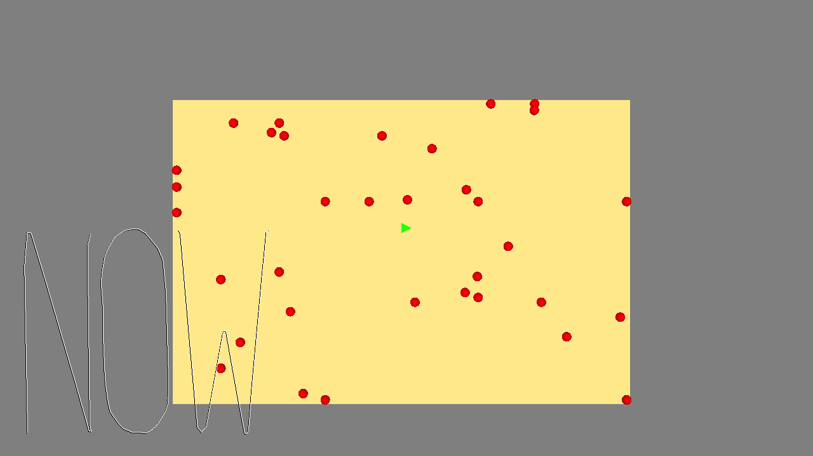

# A Deep Introspective Walk Through the Machinations of a Twisted Soul

Author: ppwilson and eeschnei

Design: Run as fast you can, but only to the beat. Hastiness is punished and will lead to your doom.

Screen Shot:

How To Play:

WASD to move, remember to only move to the beat and A V O I D

Listen the the beat of your soul to navigate away from your inner demons(represented as red ellispiods). Just play this game one time and tell me you're not moved on a visceral level.

Sources: Believe it or not, these assets were masterfully crafted by yours truly. The rythmic serenade was written, produced, and directed by Eric.

This game was built with [NEST](NEST.md).

